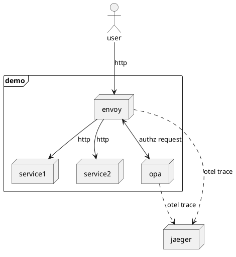

# Learning Open Policy Agent

I've recently been doing some research into continuous compliance and automated policy checking in build pipelines and the SDLC.  I wanted to see how [Open Policy Agent](https://openpolicyagent.org) could be used to help apply governance and compliance decision making to activities throughout a CI/CD pipeline, or within application software.

Interestingly, the latest ThoughtWorks Tech Radar included recommendations regarding both [Continuous Compliance](https://www.thoughtworks.com/radar/techniques/continuous-compliance) and [Open Policy Agent](https://www.thoughtworks.com/en-au/radar/tools/summary/open-policy-agent-opa).

## Introduction

This repo contains a docker-compose file which will create a small demo stack including the following:

- Open Policy Agent (OPA)
- Envoy Proxy for ingress, integrated with OPA
- Jaeger to demonstrate Observability
- A small asp.net project to demonstrate 



## Getting Started

To bring up the demo stack, run the following command

```
docker compose up -d
```

**Policy Approved**

```
curl -v -H 'Content-Type: application/json' http://service1.localtest.me/hello/world
```

**Policy Rejected**

```
curl -v -H 'Content-Type: application/json' http://service1.localtest.me/anything/else
```

## Policies Explained

The envoy proxy uses the following policy definition.  This will be automatically applied to any requests going through envoy.

```rego
package envoy.authz

import rego.v1

import input.attributes.request.http

default allow := false

allow if  {
    http.method == "GET"
    http.path == "/hello/world"
}

test_permit if {
	allow with input as {"attributes": {"request": {"http": {"method": "GET", "path": "/hello/world"}}}}
}

test_fail_method if {
	not allow with input as {"attributes": {"request": {"http": {"method": "POST", "path": "/hello/world"}}}}
}

test_fail_path if {
	not allow with input as {"attributes": {"request": {"http": {"method": "GET", "path": "/hello/fails"}}}}
}
```

## Test Driven Policy Development

One benefit of using the Rego policy syntax is that it supports inline unit testing.

```
brew install opa
opa test --verbose ./policy/envoy.rego
```

```text
./policy/envoy.rego:
data.envoy.authz.test_permit: PASS (209µs)
data.envoy.authz.test_fail_method: PASS (89.583µs)
data.envoy.authz.test_fail_path: PASS (76.292µs)
--------------------------------------------------------------------------------
PASS: 3/3
```