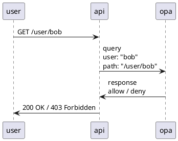

# Open Policy Agent 

```puml
@startuml
user -> api: GET /user/bob
api -> opa: query\nuser: "bob"\npath: "/user/bob"
opa -> api: response\nallow / deny
api -> user: 200 OK / 403 Forbidden
@enduml
```